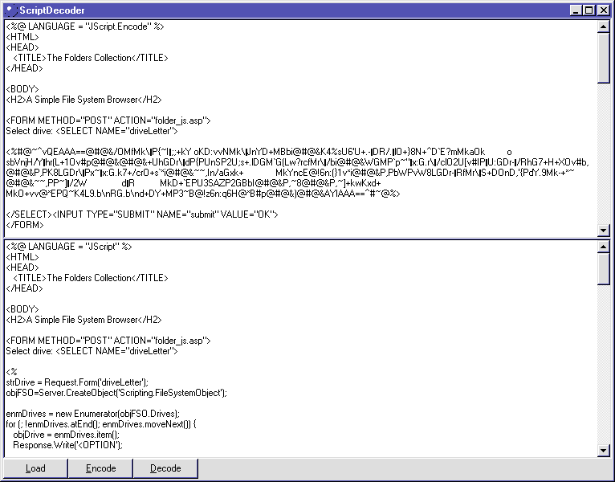



## Script Decoder \(VBS /JS\)

### Description

Update: 6/22/2001 Added exe and Encode function 

Decode HTML, ASP and JS files that were encoded with the MS script encoder SCRENC.EXE

Add the Class file to your code to include decoder functionality.
 
### More Info
 

             |
---                |---
**Submitted On**   |2001-06-22 12:40:00
**By**             |[Martijn B](https://github.com/Planet-Source-Code/PSCIndex/blob/master/ByAuthor/martijn-b.md)
**Level**          |Advanced
**User Rating**    |5.0 (20 globes from 4 users)
**Compatibility**  |VB 6\.0, VB Script, ASP \(Active Server Pages\) 
**Category**       |[Encryption](https://github.com/Planet-Source-Code/PSCIndex/blob/master/ByCategory/encryption__1-48.md)
**World**          |[Visual Basic](https://github.com/Planet-Source-Code/PSCIndex/blob/master/ByWorld/visual-basic.md)
**Archive File**   |[Script Dec214946222001\.zip](https://github.com/Planet-Source-Code/martijn-b-script-decoder-vbs-js__1-22858/archive/master.zip)

